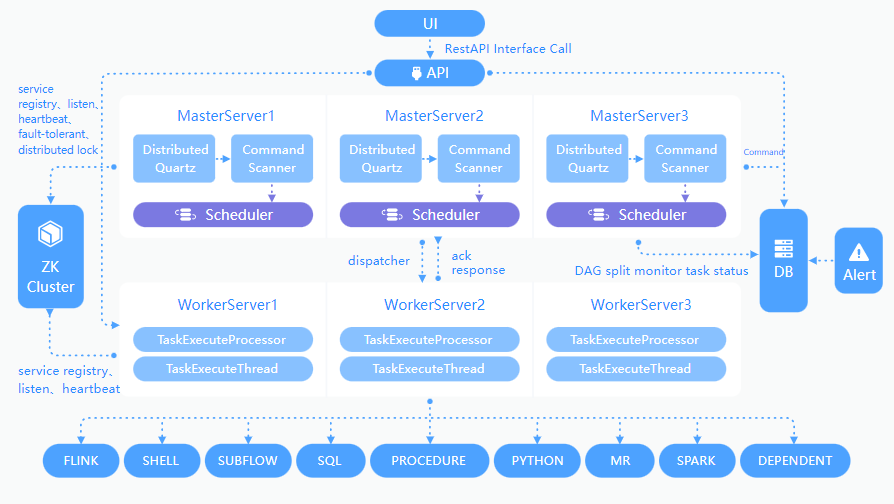
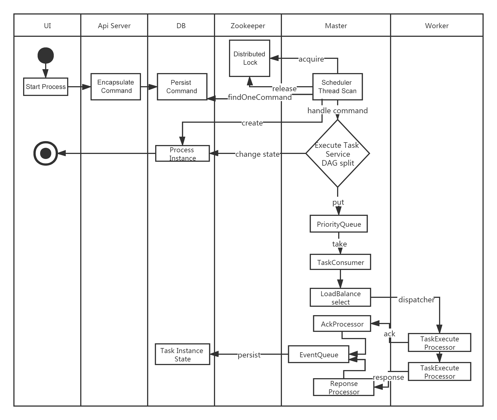
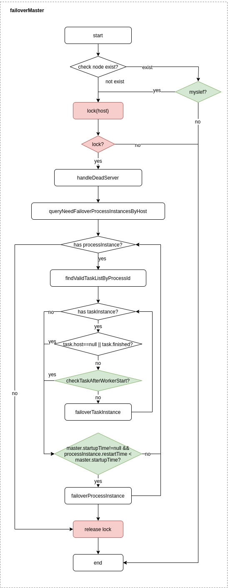
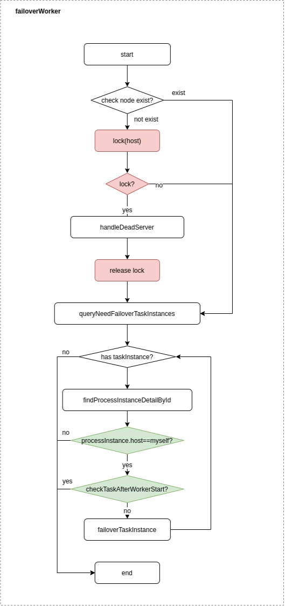

# System Architecture Design

## System Structure

### System Architecture Diagram

<p align="center">
  
  <p align="center">
        <em>System architecture diagram</em>
  </p>
</p>

### Start Process Activity Diagram

<p align="center">
  
  <p align="center">
        <em>Start process activity diagram</em>
  </p>
</p>

### Architecture Description

- **MasterServer**

  MasterServer adopts a distributed and decentralized design concept. MasterServer is mainly responsible for DAG task segmentation, task submission monitoring, and monitoring the health status of other MasterServer and WorkerServer at the same time.
  When the MasterServer service starts, register a temporary node with ZooKeeper, and perform fault tolerance by monitoring changes in the temporary node of ZooKeeper.
  MasterServer provides monitoring services based on netty.

  #### The Service Mainly Includes:

  - **DistributedQuartz** distributed scheduling component, which is mainly responsible for the start and stop operations of scheduled tasks. When quartz start the task, there will be a thread pool inside the Master responsible for the follow-up operation of the processing task;

  - **MasterSchedulerService** is a scanning thread that regularly scans the `t_ds_command` table in the database, runs different business operations according to different **command types**;

  - **WorkflowExecuteRunnable** is mainly responsible for DAG task segmentation, task submission monitoring, and logical processing of different event types;

  - **TaskExecuteRunnable** is mainly responsible for the processing and persistence of tasks, and generates task events and submits them to the event queue of the process instance;

  - **EventExecuteService** is mainly responsible for the polling of the event queue of the process instances;

  - **StateWheelExecuteThread** is mainly responsible for process instance and task timeout, task retry, task-dependent polling, and generates the corresponding process instance or task event and submits it to the event queue of the process instance;

  - **FailoverExecuteThread** is mainly responsible for the logic of Master fault tolerance and Worker fault tolerance;

- **WorkerServer**

  WorkerServer also adopts a distributed and decentralized design concept. WorkerServer is mainly responsible for task execution and providing log services.

  When the WorkerServer service starts, register a temporary node with ZooKeeper and maintain a heartbeat.
  WorkerServer provides monitoring services based on netty.

  #### The Service Mainly Includes:

  - **WorkerManagerThread** is mainly responsible for the submission of the task queue, continuously receives tasks from the task queue, and submits them to the thread pool for processing;

  - **TaskExecuteThread** is mainly responsible for the process of task execution, and the actual processing of tasks according to different task types;

  - **RetryReportTaskStatusThread** is mainly responsible for regularly polling to report the task status to the Master until the Master replies to the status ack to avoid the loss of the task status;

- **ZooKeeper**

  ZooKeeper service, MasterServer and WorkerServer nodes in the system all use ZooKeeper for cluster management and fault tolerance. With evolving needs and modern deployment environments, DolphinScheduler now supports event monitoring and distributed locks not only based on ZooKeeper, but also on **JDBC** and **Etcd** implementations.

- **JDBC**
  DolphinScheduler also provides a JDBC-based registry implementation, located in the `dolphinscheduler-registry/dolphinscheduler-registry-plugins/dolphinscheduler-registry-jdbc` module. Unlike external systems such as ZooKeeper or Etcd, the JDBC approach leverages a relational database to support event monitoring and distributed locking, making it well-suited for environments that already rely on SQL databases.

  - **Event Monitoring**

    - **Subscribe Method**
      The `subscribe(String watchedPath, SubscribeListener listener)` method in `JdbcRegistry` registers a data change listener using the `JdbcRegistryDataChangeListenerAdapter`. When changes (such as creation, update, or deletion) occur for the specified key or path in the database, the adapter converts these changes into DolphinScheduler `Event` notifications and triggers the `SubscribeListener` callback.

    - **Polling/Trigger Mechanism**
      Internally, the system uses periodic polling or a trigger-based mechanism to detect changes in the registry data stored in the database, simulating a Watcher-like behavior similar to ZooKeeper.

  - **Distributed Lock**

    - **Lock Acquisition and Release**
      The JDBC registry offers both `acquireLock(String key)` and `acquireLock(String key, long timeout)` methods, which correspond to blocking and timeout-based lock acquisition respectively. These methods internally call `JdbcRegistryClient.acquireJdbcRegistryLock(...)` to manage locks via database records, ensuring mutual exclusion in a distributed environment.

    - **Ephemeral vs. Persistent Locks**
      Data entries are classified as either **EPHEMERAL** or **PERSISTENT**. For ephemeral locks, if the client disconnects or fails, heartbeat mechanisms detect the lapse and clean up the lock record automatically, thus releasing the lock.

    - **Lock Management**
      Under the hood, components like `JdbcRegistryLockManager` (or equivalent) use row-level locking or specific database fields to ensure atomic lock operations, maintaining consistency even when multiple masters/workers compete for the same lock.

    ***

    By leveraging JDBC for both **event monitoring** and **distributed locking**, DolphinScheduler can achieve reliable task coordination and scheduling without relying on external registry centers, making it an attractive option for environments that prefer or already have robust database infrastructure.

- **Etcd**

  DolphinScheduler also provides an Etcd-based registry implementation. The Etcd-based registry, implemented in the module `dolphinscheduler-registry/dolphinscheduler-registry-plugins/dolphinscheduler-registry-etcd`, leverages the Jetcd client library to interact with an Etcd cluster. This implementation provides several key functionalities:

  - **Event Monitoring**
    - **Watch API**
      The `EtcdRegistry` class uses Etcd’s Watch API to observe changes (creation, update, or deletion) on specified keys or key prefixes. Low-level Etcd watch events are translated into DolphinScheduler’s `Event` objects, triggering `SubscribeListener` callbacks for real-time notifications.
  - **Distributed Lock**
    - **Lease-Based Locking**
      The `EtcdKeepAliveLeaseManager` grants a lease with a specified TTL, continuously kept alive via Etcd’s keep-alive mechanism. If the client disconnects, the lease expires automatically, releasing the lock without manual intervention.

    - **Connection Health Monitoring**
      The `EtcdConnectionStateListener` tracks the connection state between DolphinScheduler and the Etcd cluster. Upon disconnection or reconnection, it re-establishes locks or re-registers services as needed.

  - **Configuration**

    - **Flexible Configuration**
      The behavior of the Etcd registry is controlled by `EtcdRegistryProperties`, which maps various settings (endpoints, namespace, SSL, authentication, etc.) from configuration files. These settings are integrated into the Spring Boot auto-configuration process via `EtcdRegistryAutoConfiguration`, ensuring that the Etcd registry is instantiated automatically when `registry.type` is set to `"etcd"`.

    Together, these components ensure that DolphinScheduler can reliably use Etcd as an alternative registry center. This is especially useful in cloud-native environments where low latency, high scalability, and ease of deployment are critical.

    ***

  We have also implemented queues based on Redis, but we hope DolphinScheduler depends on as few components as possible, so we finally removed the Redis implementation.

- **AlertServer**

  Provides alarm services, and implements rich alarm methods through alarm plugins.

- **API**

  The API interface layer is mainly responsible for processing requests from the front-end UI layer. The service uniformly provides RESTful APIs to provide request services to external.

- **UI**

  The front-end page of the system provides various visual operation interfaces of the system, see more at [Introduction to Functions](../guide/homepage.md) section.

### Architecture Design Ideas

#### Decentralization VS Centralization

##### Centralized Thinking

The centralized design concept is relatively simple. The nodes in the distributed cluster are roughly divided into two roles according to responsibilities:

<p align="center">
   
 </p>

- The role of the master is mainly responsible for task distribution and monitoring the health status of the slave, and can dynamically balance the task to the slave, so that the slave node won't be in a "busy dead" or "idle dead" state.
- The role of Worker is mainly responsible for task execution and heartbeat maintenance to the Master, so that Master can assign tasks to Slave.

Problems in centralized thought design:

- Once there is a problem with the Master, the team grow aimless without commander and the entire cluster collapse. In order to solve this problem, most of the Master and Slave architecture models adopt the design scheme of active and standby Master, which can be hot standby or cold standby, or automatic switching or manual switching. More and more new systems are beginning to have ability to automatically elect and switch Master to improve the availability of the system.
- Another problem is that if the Scheduler is on the Master, although it can support different tasks in a DAG running on different machines, it will cause the Master to be overloaded. If the Scheduler is on the slave, all tasks in a DAG can only submit jobs on a certain machine. When there are more parallel tasks, the pressure on the slave may be greater.

##### Decentralized

 <p align="center">
   
 </p>

- In the decentralized design, there is usually no concept of Master or Slave. All roles are the same, the status is equal, the global Internet is a typical decentralized distributed system. Any node connected to the network goes down, will only affect a small range of functions.
- The core design of decentralized design is that there is no distinct "manager" different from other nodes in the entire distributed system, so there is no single point failure. However, because there is no "manager" node, each node needs to communicate with other nodes to obtain the necessary machine information, and the unreliability of distributed system communication greatly increases the difficulty to implement the above functions.
- In fact, truly decentralized distributed systems are rare. Instead, dynamic centralized distributed systems are constantly pouring out. Under this architecture, the managers in the cluster are dynamically selected, rather than preset, and when the cluster fails, the nodes of the cluster will automatically hold "meetings" to elect new "managers" To preside over the work. The most typical case is Etcd implemented by ZooKeeper and Go language.
- The decentralization of DolphinScheduler is that the Master and Worker register in ZooKeeper, for implement the centerless feature to Master cluster and Worker cluster. Use the ZooKeeper distributed lock to elect one of the Master or Worker as the "manager" to perform the task.

#### Fault-Tolerant Design

Fault tolerance divides into service downtime fault tolerance and task retry, and service downtime fault tolerance divides into master fault tolerance and worker fault tolerance.

##### Downtime Fault Tolerance

The service fault-tolerance design relies on ZooKeeper's Watcher mechanism, and the implementation principle shows in the figure:

 <p align="center">
   
 </p>
Among them, the Master monitors the directories of other Masters and Workers. If the remove event is triggered, perform fault tolerance of the process instance or task instance according to the specific business logic.

- Master fault tolerance：

<p align="center">
   
 </p>

Fault tolerance range: From the perspective of host, the fault tolerance range of Master includes: own host and node host that does not exist in the registry, and the entire process of fault tolerance will be locked;

Fault-tolerant content: Master's fault-tolerant content includes: fault-tolerant process instances and task instances. Before fault-tolerant, compares the start time of the instance with the server start-up time, and skips fault-tolerance if after the server start time;

Fault-tolerant post-processing: After the fault tolerance of ZooKeeper Master completed, then re-schedule by the Scheduler thread in DolphinScheduler, traverses the DAG to find the "running" and "submit successful" tasks. Monitor the status of its task instances for the "running" tasks, and for the "commits successful" tasks, it is necessary to find out whether the task queue already exists. If exists, monitor the status of the task instance. Otherwise, resubmit the task instance.

- Worker fault tolerance：

<p align="center">
   
 </p>

Fault tolerance range: From the perspective of process instance, each Master is only responsible for fault tolerance of its own process instance; it will lock only when `handleDeadServer`;

Fault-tolerant content: When sending the remove event of the Worker node, the Master only fault-tolerant task instances. Before fault-tolerant, compares the start time of the instance with the server start-up time, and skips fault-tolerance if after the server start time;

Fault-tolerant post-processing: Once the Master Scheduler thread finds that the task instance is in the "fault-tolerant" state, it takes over the task and resubmits it.

Note: Due to "network jitter", the node may lose heartbeat with ZooKeeper in a short period of time, and the node's remove event may occur. For this situation, we use the simplest way, that is, once the node and ZooKeeper timeout connection occurs, then directly stop the Master or Worker service.

##### Task Failed and Try Again

Here we must first distinguish the concepts of task failure retry, process failure recovery, and process failure re-run:

- Task failure retry is at the task level and is automatically performed by the schedule system. For example, if a Shell task sets to retry for 3 times, it will try to run it again up to 3 times after the Shell task fails.
- Process failure recovery is at the process level and is performed manually. Recovery can only perform **from the failed node** or **from the current node**.
- Process failure re-run is also at the process level and is performed manually, re-run perform from the beginning node.

Next to the main point, we divide the task nodes in the workflow into two types.

- One is a business task, which corresponds to an actual script or process command, such as Shell task, SQL task, and Spark task.

- Another is a logical task, which does not operate actual script or process command, but only logical processing to the entire process flow, such as sub-process task, dependent task.

**Business node** can configure the number of failed retries. When the task node fails, it will automatically retry until it succeeds or exceeds the retry times. **Logical node** failure retry is not supported.

If there is a task failure in the workflow that reaches the maximum retry times, the workflow will fail and stop, and the failed workflow can be manually re-run or process recovery operations.

#### Task Priority Design

In the early schedule design, if there is no priority design and use the fair scheduling, the task submitted first may complete at the same time with the task submitted later, thus invalid the priority of process or task. So we have re-designed this, and the following is our current design:

- According to **the priority of different process instances** prior over **priority of the same process instance** prior over **priority of tasks within the same process** prior over **tasks within the same process**, process task submission order from highest to Lowest.
  - The specific implementation is to parse the priority according to the JSON of the task instance, and then save the **process instance priority_process instance id_task priority_task id** information to the ZooKeeper task queue. When obtain from the task queue, we can get the highest priority task by comparing string.
    - The priority of the process definition is to consider that some processes need to process before other processes. Configure the priority when the process starts or schedules. There are 5 levels in total, which are HIGHEST, HIGH, MEDIUM, LOW, and LOWEST. As shown below

      <p align="center">
         
       </p>

    - The priority of the task is also divides into 5 levels, ordered by HIGHEST, HIGH, MEDIUM, LOW, LOWEST. As shown below:

        <p align="center">
           
         </p>

#### Logback and Netty Implement Log Access

- Since Web (UI) and Worker are not always on the same machine, to view the log cannot be like querying a local file. There are two options:
- Put logs on the ES search engine.
- Obtain remote log information through netty communication.
- In consideration of the lightness of DolphinScheduler as much as possible, so choose gRPC to achieve remote access to log information.

 <p align="center">
   
 </p>

- For details, please refer to the logback configuration of Master and Worker, as shown in the following example:

```xml
<conversionRule conversionWord="message" converterClass="org.apache.dolphinscheduler.plugin.task.api.log.SensitiveDataConverter"/>
<appender name="TASKLOGFILE" class="ch.qos.logback.classic.sift.SiftingAppender">
    <filter class="org.apache.dolphinscheduler.plugin.task.api.log.TaskLogFilter"/>
    <Discriminator class="org.apache.dolphinscheduler.plugin.task.api.log.TaskLogDiscriminator">
        <key>taskAppId</key>
        <logBase>${log.base}</logBase>
    </Discriminator>
    <sift>
        <appender name="FILE-${taskAppId}" class="ch.qos.logback.core.FileAppender">
            <file>${log.base}/${taskAppId}.log</file>
            <encoder>
                <pattern>
                            [%level] %date{yyyy-MM-dd HH:mm:ss.SSS Z} [%thread] %logger{96}:[%line] - %message%n
                </pattern>
                <charset>UTF-8</charset>
            </encoder>
            <append>true</append>
        </appender>
    </sift>
</appender>
```

## Sum Up

From the perspective of scheduling, this article preliminarily introduces the architecture principles and implementation ideas of the big data distributed workflow scheduling system: DolphinScheduler. To be continued.
