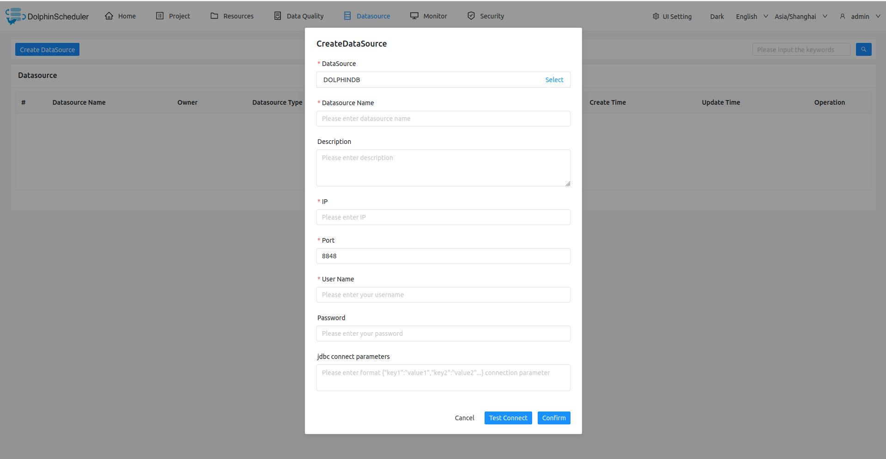

# DolphinDB

- Datasource: Select DOLPHINDB
- Datasource Name: Enter the name of the DataSource
- Description: Enter a description of the DataSource
- IP/Host Name: Enter the DolphinDB service IP
- Port: Enter the DolphinDB service port
- Username: Set the username for DolphinDB connection
- Password: Set the password for DolphinDB connection
- JDBC connection parameters: Parameter settings for DolphinDB connection, in JSON format

## Native Supported

- No, read section example in [pseudo-cluster](../installation/pseudo-cluster.md) `Download Plugins Dependencies` section to activate this datasource.
- JDBC driver configuration reference [DolphinDB JDBC Connector](https://docs.dolphindb.com/en/API/JDBC.html)
- Driver Maven dependency [com.dolphindb:jdbc:3.00.3.0](https://mvnrepository.com/artifact/com.dolphindb/jdbc/3.00.3.0)

