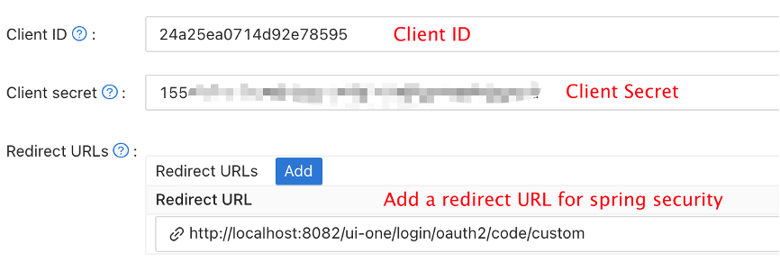
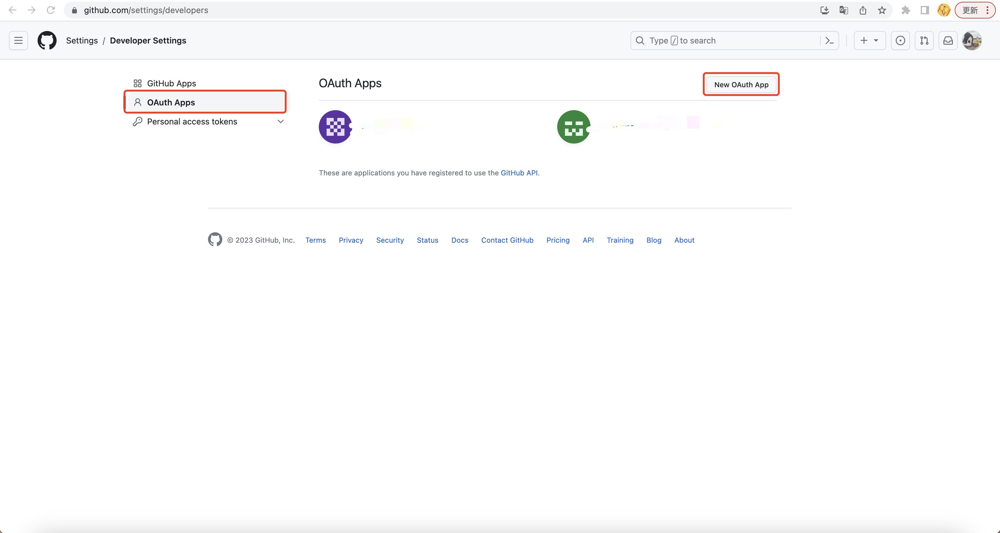
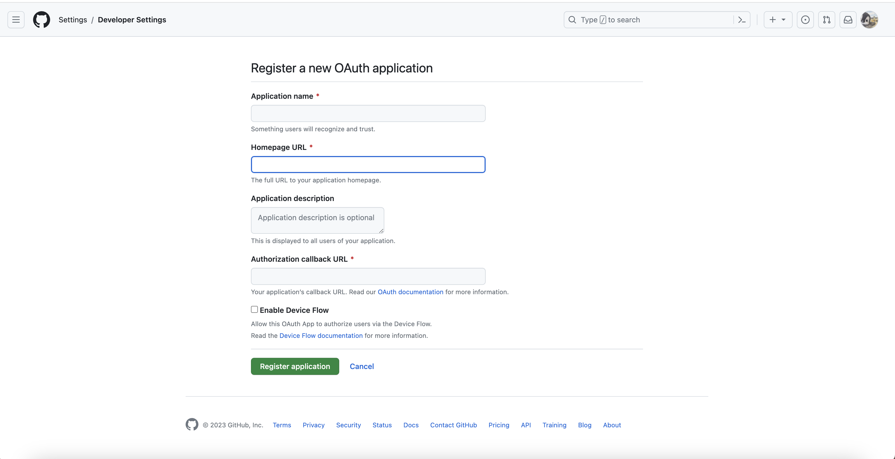
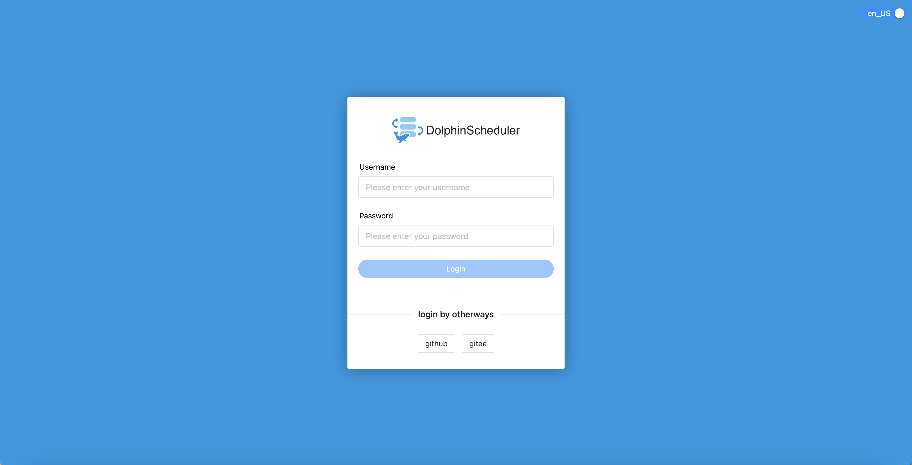

# Authentication Type

* So far we support four authentication types, Apache DolphinScheduler password, LDAP, Casdoor SSO, OAuth2, and OIDC (OpenID Connect). The OAuth2 authorization login mode can be used with other authentication modes.

## Change Authentication Type

> dolphinscheduler-api/src/main/resources/application.yaml

```yaml
security:
  authentication:
    # Authentication types (supported types: PASSWORD,LDAP,CASDOOR_SSO, OIDC)
    type: LDAP
    # IF you set type `LDAP`, below config will be effective
    ldap:
      # ldap server config
      url: ldap://ldap.forumsys.com:389/
      base-dn: dc=example,dc=com
      username: cn=admin,dc=example,dc=com
      password: password
      user:
        # admin userId when you use LDAP login
        admin: ldap-admin
        # user search filter to find admin user
        admin-user-filter: (&(cn={0}))
        identity-attribute: uid
        email-attribute: mail
        # action when ldap user is not exist (supported types: CREATE,DENY)
        not-exist-action: DENY
      ssl:
        enable: false
        # jks file absolute path && password
        trust-store: "/ldapkeystore.jks"
        trust-store-password: "password"
    casdoor:
      user:
        admin: ""
    oauth2:
      enable: false
      provider:
        github:
          authorizationUri: ""
          redirectUri: ""
          clientId: ""
          clientSecret: ""
          tokenUri: ""
          userInfoUri: ""
          callbackUrl: ""
          iconUri: ""
          provider: github
        google:
          authorizationUri: ""
          redirectUri: ""
          clientId: ""
          clientSecret: ""
          tokenUri: ""
          userInfoUri: ""
          callbackUrl: ""
          iconUri: ""
          provider: google
casdoor:
   # Your Casdoor server url
   endpoint: ""
   client-id: ""
   client-secret: ""
   # The certificate may be multi-line, you can use `|-` for ease
   certificate: ""
   # Your organization name added in Casdoor
   organization-name: ""
   # Your application name added in Casdoor
   application-name: ""
   # Doplhinscheduler login url
   redirect-url: ""
```

## Casdoor SSO

[Casdoor](https://casdoor.org/) is a UI-first Identity Access Management (IAM) / Single-Sign-On (SSO) platform based on OAuth 2.0, OIDC, SAML and CAS. You can add SSO capability to Dolphinscheduler through Casdoor by following these steps:

### Step1. Deploy Casdoor

Firstly, the Casdoor should be deployed.

You can refer to the Casdoor official documentation for the [Server Installation](https://casdoor.org/docs/basic/server-installation).

After a successful deployment, you need to ensure:

* The Casdoor server is successfully running on http://localhost:8000.
* Open your favorite browser and visit http://localhost:7001, you will see the login page of Casdoor.
* Input admin and 123 to test login functionality is working fine.

Then you can quickly implement a Casdoor based login page in your own app with the following steps.

### Step2. Configure Casdoor Application

1. Create or use an existing Casdoor application.
2. Add Your redirect url (You can see more details about how to get redirect url in the next section)
   
3. Add provider you want and supplement other settings.

Not surprisingly, you can get two values on the application settings page: `Client ID` and `Client secret` like the picture above. We will use them in next step.

Open your favorite browser and visit: **http://`CASDOOR_HOSTNAME`/.well-known/openid-configuration**, you will see the OIDC configure of Casdoor.

### Step3. Configure Dolphinscheduler

> dolphinscheduler-api/src/main/resources/application.yaml

```yaml
security:
  authentication:
    # Authentication types (supported types: PASSWORD,LDAP,CASDOOR_SSO)
    type: CASDOOR_SSO
casdoor:
  # Your Casdoor server url
  endpoint:
  client-id:
  client-secret:
  # The certificate may be multi-line, you can use `|-` for ease
  certificate: 
  # Your organization name added in Casdoor
  organization-name:
  # Your application name added in Casdoor
  application-name:
  # Doplhinscheduler login url
  redirect-url: http://localhost:5173/login 
```

## OAuth2

Dolphinscheduler can support multiple OAuth2 providers.

### Step1. Create Client Credentials





### Step2.Enable OAuth2 Login In The Api's Configuration File

```yaml
security:
  authentication:
    # omit
    oauth2:
      # Set enable to true to enable oauth2 login mode
      enable: true
      provider:
        github:
          # Set the provider authorization address, for example:https://github.com/login/oauth/authorize
          authorizationUri: ""
          # dolphinscheduler backend redirection interface address, for example :http://127.0.0.1:12345/dolphinscheduler/redirect/login/oauth2
          redirectUri: ""
          #  clientId
          clientId: ""
          # client secret
          clientSecret: ""
          # Set the provider's request token address
          tokenUri: ""
          # Set the provider address for requesting user information
          userInfoUri: ""
          # Redirect address after successful login, http://{ip}:{port}/login
          callbackUrl: ""
          # The image url of the login page jump button, if not filled, a text button will be displayed
          iconUri: ""
          provider: github
        google:
          authorizationUri: ""
          redirectUri: ""
          clientId: ""
          clientSecret: ""
          tokenUri: ""
          userInfoUri: ""
          callbackUrl: ""
          iconUri: ""
          provider: google
        gitee:
          authorizationUri: "https://gitee.com/oauth/authorize"
          redirectUri: "http://127.0.0.1:12345/dolphinscheduler/redirect/login/oauth2"
          clientId: ""
          clientSecret: ""
          tokenUri: "https://gitee.com/oauth/token?grant_type=authorization_code"
          userInfoUri: "https://gitee.com/api/v5/user"
          callbackUrl: "http://127.0.0.1:5173/login"
          iconUri: ""
          provider: gitee
```

### Step.3 Login With OAuth2



---

## OIDC (OpenID Connect)

The OIDC authentication method allows DolphinScheduler to integrate with a wide range of external identity providers, enabling centralized Single Sign-On (SSO). This is ideal for enterprise environments that need to connect with their internal user directories or third-party providers.

This implementation is generalized and supports any OIDC-compliant provider, such as **Keycloak, Okta, Microsoft Entra ID (Azure AD), Google, DexIDP, Auth0, Feishu, and WeChat Work Login**.

### Step 1. Enable OIDC in the API's Configuration File

1. To enable OIDC, you first need to set the authentication `type` to `OIDC`, modify the following configuration in `dolphinscheduler-api/src/main/resources/application.yaml`:

```yaml
security:
  authentication:
    # Authentication types (supported types: PASSWORD, LDAP, CASDOOR_SSO, OIDC)
    type: OIDC
```

2. Then, you must configure the OIDC providers you wish to use. The following is a complete example configuration using Keycloak, with a detailed explanation of each parameter.

> **Note**: Before configuring OIDC, ensure you have set the public-facing URLs for the API and UI, as these are crucial for constructing the correct callback URLs for the OIDC provider.

```yaml
# dolphinscheduler-api/src/main/resources/application.yaml

# These top-level URLs are essential for OIDC to function correctly.
api:
  # The public-facing base URL of the DolphinScheduler API server.
  # This is used to build the `redirect_uri` for the OIDC provider.
  # It must be reachable by the user's browser.
  base-url: http://localhost:12345/dolphinscheduler
  # The public-facing URL of the DolphinScheduler UI.
  # Users will be redirected here after a successful login.
  ui-url: http://localhost:5173

security:
  authentication:
    # Set the primary authentication type to OIDC.
    type: OIDC
    oidc:
      # Master switch to enable or disable the OIDC feature.
      enable: true
      # A map of OIDC provider configurations. The key (e.g., "keycloak") is the provider's unique registrationId,
      # which is used in the login and callback URLs.
      providers:
        # --- Example for Keycloak ---
        keycloak:
          # The text displayed on the login button on the UI.
          display-name: "Login with Keycloak"
          # The URL of your OIDC provider's issuer. This is the core endpoint for OIDC discovery.
          # For Keycloak, it typically ends with /realms/{your-realm-name}.
          issuer-uri: http://localhost:8080/realms/dolphinscheduler
          # The relative path to an icon for the login button. The image should be placed in the `dolphinscheduler-ui/public/images/providers-icon/` directory.
          icon-uri: "/images/providers-icon/keycloak.png"
          # The Client ID obtained from your OIDC provider after registering DolphinScheduler as a client.
          client-id: dolphinscheduler-client
          # The Client Secret obtained from your OIDC provider.
          client-secret: dolphinscheduler-client-secret
          # (Optional) The method used to authenticate with the token endpoint.
          # Can be "client_secret_basic" (default) or "client_secret_post".
          # client-authentication-method: client_secret_basic
          # The OIDC scopes to request. "openid" is mandatory. "profile", "email", and "groups" are recommended
          # to get user information and roles.
          scope: openid, profile, email, groups
          # The claim in the ID Token or UserInfo response to use as the DolphinScheduler username.
          # "preferred_username" is common, but could also be "email", "sub", or a custom claim.
          user-name-attribute: preferred_username
          # (Optional) The claim that contains the user's group or role memberships.
          # This is required for admin role mapping.
          groups-claim: groups

        # --- You can add more providers here ---
        # okta:
        #   display-name: "Login with Okta"
        #   issuer-uri: [https://your-okta-domain.okta.com/oauth2/default](https://your-okta-domain.okta.com/oauth2/default)
        #   ...

      # Settings for automatic user provisioning in DolphinScheduler upon first OIDC login.
      user:
        # If true, a new DolphinScheduler user will be created if one doesn't exist upon successful login.
        # If false, only existing users can log in. Default is false.
        auto-create: true
        # The default tenant to assign to newly created users.
        default-tenant-code: "default"
        # The default queue to assign to newly created users.
        default-queue: "default"
        # A list of group names from the OIDC provider that will grant a user ADMIN privileges in DolphinScheduler.
        # The user's groups are read from the claim specified in "groups-claim".
        admin-group-mapping:
          - dolphinscheduler-admins
```

> **Note on `issuer-uri`**: The correct value depends on your environment.
> - If running DolphinScheduler **locally (e.g., in your IDE)** and Keycloak in Docker, use the host machine's address (e.g., `http://localhost:8080/...`).
> - If both DolphinScheduler and Keycloak are running **within the same Docker network** (as in the provided ), you must use the Docker service name (e.g., `http://keycloak:8080/...`) for container-to-container communication. `docker-compose.yaml`
>
> **💡 Tip**: **Configuring with Environment Variables** - All properties in `application.yaml` can be configured using environment variables. This is particularly useful for containerized deployments. To convert a YAML path to an environment variable, use uppercase letters and replace dots (`.`) and hyphens (`-`) with underscores (`_`).  
> For example, `security.authentication.oidc.providers.keycloak.client-id` becomes `SECURITY_AUTHENTICATION_OIDC_PROVIDERS_KEYCLOAK_CLIENT_ID`.

### Step 2. Configure Your OIDC Provider (Keycloak Example)

You need to register DolphinScheduler as a client in your OIDC provider. Here’s how to do it with Keycloak:

#### 2.1. Easy setup using Pre-configured Realm Export:

1. Start Keycloak with the provided `docker-compose.yaml` that includes a pre-configured realm, Ensure docker is running in the background:

   ```bash
   cd dolphinscheduler-api-test/dolphinscheduler-api-test-case/src/test/resources/docker/oidc-login/
   docker-compose up -d keycloak
   ```

   This will start Keycloak on port `8081` and imports a realm with the necessary client, users, and groups.

2. Access the Keycloak Admin Console at `http://localhost:8081` (Username: `admin`, Password: `admin`).

3. Switch to the `dolphinscheduler` realm and verify the imported configuration.

4. Update the **Valid redirect URIs** in the `dolphinscheduler-client` client to match your local setup:

   * `http://localhost:12345/dolphinscheduler/login/oauth2/code/keycloak`
5. Update **Web origins** to include `http://localhost:5173` to prevent CORS issues.
6. Save your changes.
7. Obtain the **Client ID** and **Client Secret** from the `dolphinscheduler-client` client in Keycloak.
8. Use these values in your DolphinScheduler configuration as shown in Step 1.
9. Once done with the testing/development, you can stop the Keycloak container using:

   ```bash
   docker-compose down
   ```

_**or,**_

#### 2.2. Using Custom configuration:

1. Spin up a Keycloak instance using docker (if you haven't already), Ensure docker is running in the background:

   ```bash
   docker run --rm -p 8080:8080 -e KEYCLOAK_ADMIN=admin -e KEYCLOAK_ADMIN_PASSWORD=admin quay.io/keycloak/keycloak:22.0.1 start-dev
   ```

   This starts Keycloak on port `8080` with an admin user (Username: `admin`, Password: `admin`).

2. **Create a Realm**: If you don't have one, create a new realm (e.g., `dolphinscheduler`).

3. **Create a Client**:

   * Navigate to **Clients** and click **Create client**.
   * Set the **Client ID** to match your configuration (e.g., `dolphinscheduler-client`).
   * Ensure **Client authentication** is **On**.
   * On the next screen, set **Valid redirect URIs**. This is critical and must match the URL constructed from your `api.base-url`:
     * `http://{your-dolphinscheduler-host:port}/dolphinscheduler/login/oauth2/code/{registrationId}`
     * For our example: `http://localhost:12345/dolphinscheduler/login/oauth2/code/keycloak`
   * Set **Web origins** to allow the UI to communicate with Keycloak (e.g., `http://localhost:5173`).
   * **Configure Client Scopes for Email and Profile**:
     * In the Keycloak Admin Console, go to **Client scopes**.
     * Ensure the built-in `email` and `profile` scopes are assigned to your client:
       * Navigate to your client (**Clients** -> select your client -> **Client scopes** tab).
       * Under **Assigned Default Client Scopes**, add `email` and `profile` if they are not already present.
     * This ensures that the OIDC tokens include the user's email and profile information, which DolphinScheduler may require for user provisioning and display.
4. **Get Credentials**:

* Go to the **Credentials** tab for your new client and copy the **Client secret**.

5. **Create a Reusable `groups` Scope (Recommended)**:
   - In the left menu, navigate to **Client Scopes** and click **Create client scope**.
   - Set the **Name** to `groups` and click **Save**.
   - Go to the **Mappers** tab for your new `groups` scope.
   - Click **Create mapper** and select **Group Membership** from the list.
   - Give it a **Name** (e.g., "groups mapper").
   - Set the **Token Claim Name** to `groups` (this must match the property in your ). `groups-claim``application.yaml`
   - Ensure **Add to ID token** is enabled. Click **Save**.
   - Finally, navigate back to your client (**Clients** -> -> **Client Scopes** tab). `dolphinscheduler-client`
   - Add your new `groups` scope to the **Default Client Scopes**. This ensures the `groups` claim is included for all users of this client.
6. **Create Groups and Users**:

* Navigate to **Groups** and create a group with the name you specified in `admin-group-mapping` (e.g., `dolphinscheduler-admins`).
  * Navigate to **Users**, create a new user, and assign them to this group.

_**or,**_

#### 2.3. If you have existing OIDC provider (Okta, Azure AD, Google, etc.)

1. Follow the provider's documentation to register a new application/client.
2. Set the redirect URI to `http://{your-dolphinscheduler-host:port}/dolphinscheduler/login/oauth2/code/{registrationId}`.
3. Obtain the Client ID and Client Secret.
4. Configure scopes to include `openid`, `profile`, `email`, and any `group/role` claims if needed.
5. Ensure the user information endpoint provides the necessary claims for username and groups.
6. Map any necessary roles or groups in your OIDC provider to match the `admin-group-mapping` in your DolphinScheduler configuration.
7. Make sure to test the configuration by logging in with a user that belongs to the admin group.
8. Refer to the provider-specific documentation for any additional settings required.
9. Ensure that the OIDC provider's metadata endpoint (usually `/.well-known/openid-configuration`) is accessible from the DolphinScheduler API server.
10. Adjust firewall or network settings if necessary to allow communication between DolphinScheduler and the OIDC provider.
11. If using a self-signed certificate for HTTPS, ensure that the DolphinScheduler API server trusts the certificate.
12. Regularly update the Client Secret and review the OIDC provider's security settings to maintain a secure integration.

### Step 3. Login with OIDC

After restarting the DolphinScheduler API server with the new configuration, the login page will now display a new button for each configured OIDC provider.

Clicking the button will redirect you to your OIDC provider to authenticate. After a successful login, you will be redirected back to DolphinScheduler and automatically logged in.

> **Note:** When a user clicks a provider's login button, they are first directed to a specific endpoint on the DolphinScheduler backend (e.g., `/dolphinscheduler/oauth2/authorization/keycloak`). The backend then constructs the full request and redirects the user's browser to the OIDC provider's login page.

