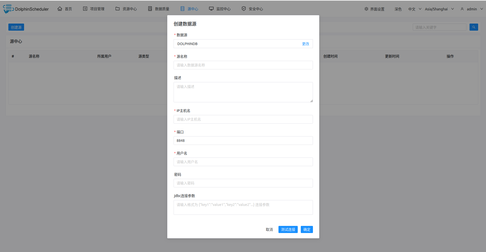

# DOLPHINDB 数据源

- 数据源：选择 DOLPHINDB
- 数据源名称：输入数据源的名称
- 描述：输入数据源的描述
- IP 主机名：输入连接 DOLPHINDB 的 IP
- 端口：输入连接 DOLPHINDB 的端口
- 用户名：设置连接 DOLPHINDB 的用户名
- 密码：设置连接 DOLPHINDB 的密码
- JDBC 连接参数：用于 DOLPHINDB 连接的参数设置，以 JSON 形式填写

## 是否原生支持

- 否，使用前需请参考 [pseudo-cluster](../installation/pseudo-cluster.md) 中的 "下载插件依赖" 章节激活数据源。
- JDBC驱动配置参考文档 [DolphinDB JDBC Connector](https://docs.dolphindb.cn/zh/jdbcdoc/jdbc.html)
- 驱动Maven依赖 [com.dolphindb:jdbc:3.00.3.0](https://mvnrepository.com/artifact/com.dolphindb/jdbc/3.00.3.0)

