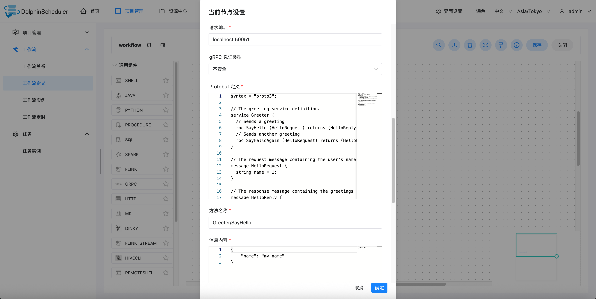
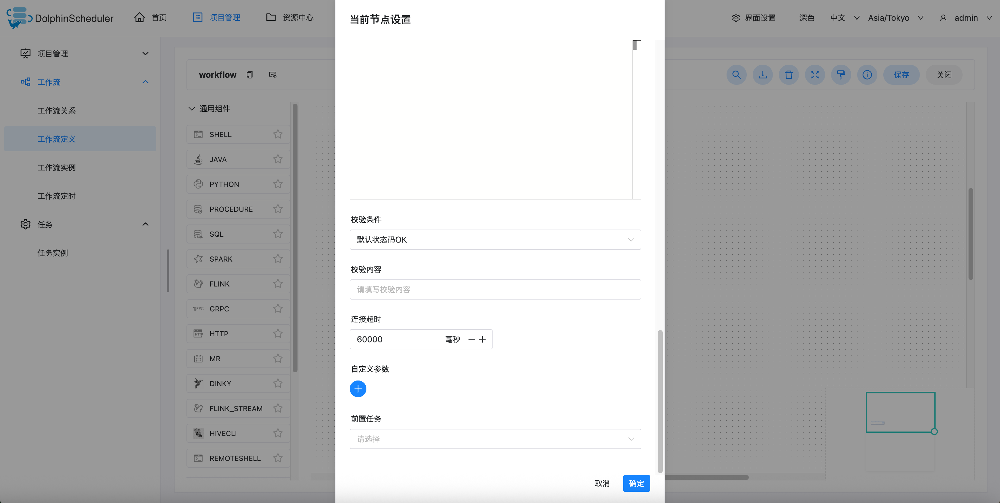

# GRPC 节点

## 综述

该节点用于执行 gRPC 类型的任务，并支持检查 gRPC 状态码, SSL/TLS 等功能。

## 创建任务

- 点击项目管理 -> 项目名称 -> 工作流定义，点击”创建工作流”按钮，进入 DAG 编辑页面：

- 拖动工具栏的  任务节点到画板中。

## 任务参数

[//]: # (TODO: use the commented anchor below once our website template supports this syntax)
[//]: # (- 默认参数说明请参考[DolphinScheduler任务参数附录]&#40;appendix.md#默认任务参数&#41;`默认任务参数`一栏。)

- 默认参数说明请参考[DolphinScheduler任务参数附录](appendix.md)`默认任务参数`一栏。

|   **任务参数**    |                                      **描述**                                      |
|---------------|----------------------------------------------------------------------------------|
| 请求地址          | gRPC 请求 URL, 需使用 `hostname:port` 格式                                              |
| gRPC 凭证类型     | 支持 None（不安全）, 客户端默认 SSL/TLS 两种凭证类型                                               |
| Protobuf 服务定义 | 用于 `.proto` 文件中定义服务的 protobuf 代码，保存时会将该内容转换为 JSON Descriptor                     |
| 请求方法          | 要调用的 rpc 方法，需在服务定义中定义，写作 `Greeter/SayHello` 格式                                   |
| 消息内容          | 使用 JSON 定义的请求消息，请求时会合并到服务定义中                                                     |
| 校验条件          | 支持默认 gRPC 状态码（OK）、自定义状态码                                                         |
| 校验内容          | 当校验条件选择自定义响应码、需填写检验内容，需与 [gRPC 状态码](https://grpc.io/docs/guides/status-codes/)一致 |
| 自定义参数         | 是 gRPC 局部的用户自定义参数，会替换脚本中以 ${变量} 的内容                                              |

## 任务输出参数

| **任务参数** |                **描述**                |
|----------|--------------------------------------|
| response | VARCHAR, 符合 ProtoJS 格式, gRPC 请求的返回结果 |

可以在下游任务中使用 ${taskName.response} 引用任务输出参数。

如，当前 task1 为 gRPC 任务, 下游任务可以使用 `${task1.response}` 引用task1的输出参数

## 任务样例

gRPC 定义的
主要配置参数如下(以下参数均可通过内置参数替换)：

- 请求地址：访问目标 gRPC 服务的地址，这里为本地的 50051 端口。
- gRPC 凭证类型：不安全
- Protobuf 定义: gRPC 服务所使用的 protobuf 定义
- 方法名称: 要调用的 rpc 方法，`Greeter/SayHello` 格式
- 消息内容: 使用 JSON 定义的请求消息
- 校验条件：默认 gRPC 状态码 OK、自定义状态码
- 校验内容：校验条件为自定义状态码时，需填写校验内容，校验内容为精确匹配 gRPC 状态码字符串

